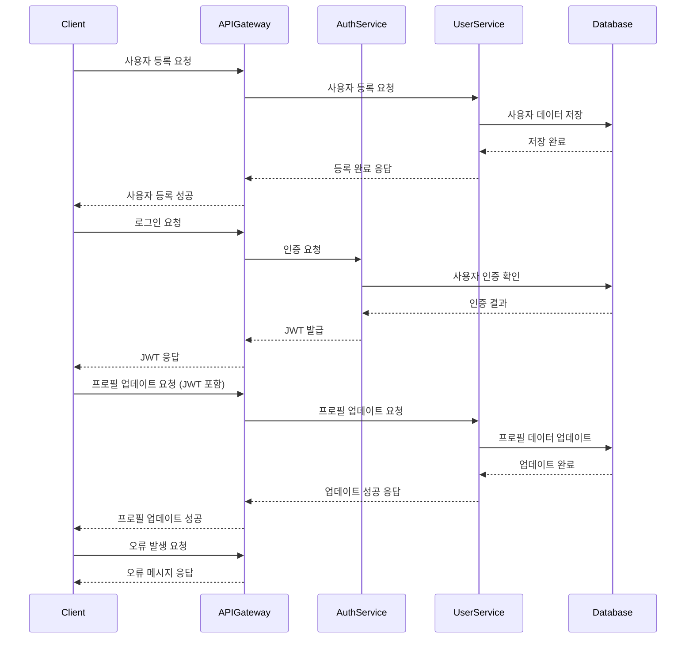

# 디자인 문서 (design.md)

## 아키텍처
- ### 상위 레벨 시스템 아키텍처
  User Management Service는 RESTful API를 통해 사용자 등록, 인증, 프로필 관리 및 권한 부여를 처리하는 마이크로서비스 아키텍처를 채택합니다. 시스템은 클라이언트, API 게이트웨이, 인증 서비스, 사용자 서비스, 데이터베이스로 구성됩니다.

- ### 컴포넌트 개요 및 책임
  - **클라이언트**: 사용자와 상호작용하는 프론트엔드 애플리케이션.
  - **API 게이트웨이**: 클라이언트 요청을 적절한 서비스로 라우팅.
  - **인증 서비스**: 사용자 인증 및 JWT 발급.
  - **사용자 서비스**: 사용자 등록, 프로필 관리 및 권한 관리.
  - **데이터베이스**: 사용자 데이터 저장 및 관리.

- ### 기술 스택 결정
  - **프로그래밍 언어**: Python (Flask 또는 FastAPI)
  - **데이터베이스**: PostgreSQL
  - **인증**: JWT, OAuth 2.0
  - **로깅 및 모니터링**: Prometheus, ELK 스택

- ### 통합 패턴
  - RESTful API를 통해 서비스 간 통신 및 데이터 교환.

## 시퀀스 다이어그램

## 데이터 모델
- ### 엔티티 정의 및 관계
  - **User**: 사용자 정보 (ID, 이메일, 비밀번호 해시, 역할, 프로필 사진 등)
  - **Role**: 역할 정보 (ID, 역할 이름)
  - **Permission**: 권한 정보 (ID, 권한 이름)
  - **User-Role 관계**: 다대다 관계 (하나의 사용자가 여러 역할을 가질 수 있음)

- ### 데이터 흐름 설명
  사용자 등록 시, 클라이언트가 API를 통해 사용자 정보를 전송하고, 서비스는 이를 데이터베이스에 저장합니다. 인증 시, 사용자의 자격 증명을 확인하고 JWT를 발급합니다.

- ### 저장 요구사항
  PostgreSQL 데이터베이스에 사용자 정보, 역할 및 권한 정보를 저장.

- ### 데이터 검증 규칙
  - 이메일 형식 검증
  - 비밀번호 복잡성 검증 (최소 8자, 대문자, 소문자, 숫자 포함)

## API 계약
- ### 상세한 API 명세
  - **POST /register**: 사용자 등록
    - 요청: { "email": "string", "password": "string" }
    - 응답: { "message": "등록 성공" }
    - 상태 코드: 201
  - **POST /login**: 사용자 로그인
    - 요청: { "email": "string", "password": "string" }
    - 응답: { "token": "JWT" }
    - 상태 코드: 200
  - **PUT /profile**: 프로필 업데이트
    - 요청: { "photo": "string", "email": "string" }
    - 응답: { "message": "업데이트 성공" }
    - 상태 코드: 200

- ### 요청/응답 형식
  JSON 형식 사용.

- ### 상태 코드 및 오류 처리
  모든 API는 적절한 HTTP 상태 코드를 반환해야 하며, 오류 발생 시 명확한 오류 메시지를 제공해야 합니다.

- ### 인증 및 권한 부여
  JWT를 사용하여 API 요청을 인증하고, 역할 기반 접근 제어를 통해 권한을 관리합니다.

## 보안 & 권한
- ### 보안 아키텍처
  사용자 비밀번호는 bcrypt로 해싱하여 저장하며, JWT는 RS256 서명을 사용합니다.

- ### 권한 모델
  - **Admin**: 모든 권한
  - **User**: 기본 사용자 권한
  - **Guest**: 제한된 권한

- ### 데이터 보호 조치
  데이터는 전송 중 및 저장 시 암호화되어야 하며, GDPR을 준수해야 합니다.

- ### 보안 제어 구현
  정기적인 보안 감사 및 데이터 보존 정책을 마련해야 합니다.

## 성능 목표
- ### 성능 목표 및 SLA
  API 응답 시간은 200ms 이내로 유지해야 하며, 99.9% 가용성을 목표로 합니다.

- ### 확장성 요구사항
  수평 확장이 가능하도록 설계하여, 사용자 수 증가에 따라 시스템을 확장할 수 있어야 합니다.

- ### 리소스 활용 목표
  CPU 및 메모리 사용률은 70% 이하로 유지해야 합니다.

- ### 부하 처리 전략
  부하 분산을 통해 여러 서버에 요청을 분산시켜야 합니다.
